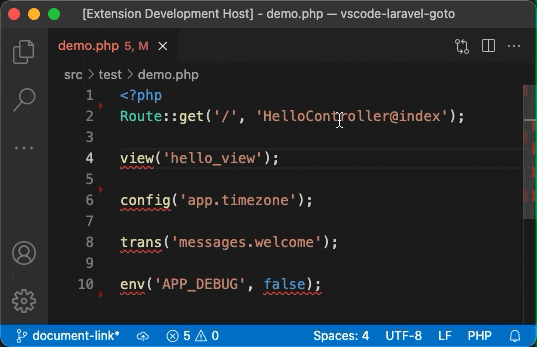
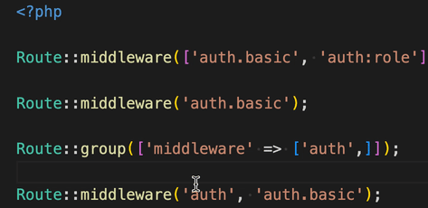
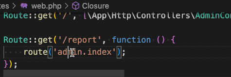
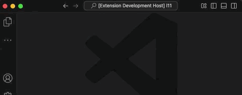
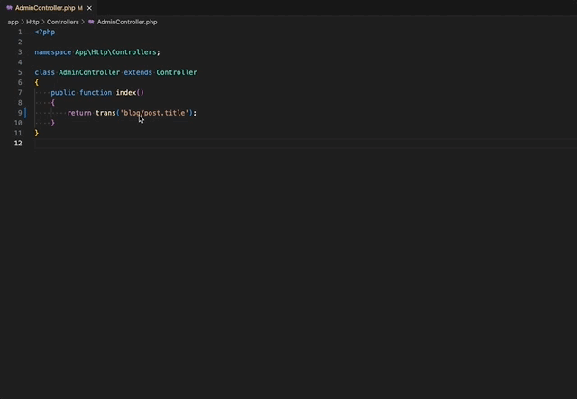
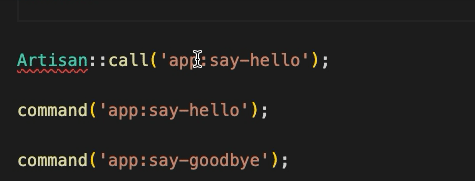
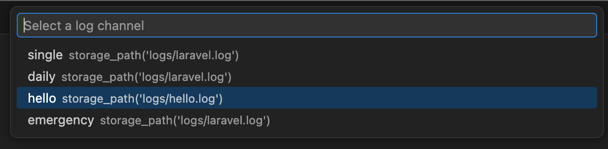

# Laravel Goto

[](https://marketplace.visualstudio.com/items?itemName=absszero.vscode-laravel-goto)
[](https://open-vsx.org/extension/absszero/vscode-laravel-goto)

Quick navigation extension for Laravel projects. Jump to views, controllers, configs, language files and more with a single click.



## Usage

**Method 1:** Hover over any supported text and click the link or press <kbd>Alt</kbd> + <kbd>;</kbd>

**Method 2:** Select text → Right-click → Choose `Laravel Goto`

## Features

### Views & Components

#### Blade Templates
Jump to blade view files from:
```php
view('hello_view', ['name' => 'James']);

Route::view('/', 'pages.public.index');

@includeIf('view.name', ['status' => 'complete'])

@each('view.name', $jobs, 'job', 'view.empty')

@extends('layouts.app')
```

#### Blade Components
```php
<x-alert:hello />
```

#### Inertia.js
```php
Route::inertia('/about', 'About/AboutComponent');

Inertia::render('MyComponent');

inertia('About/AboutComponent');
```

#### Livewire
```php
@livewire('nav.show-post')

<livewire:nav.show-post />
```

---

### Controllers & Routes

#### Controller Actions
Jump to controllers with method highlighting:
```php
Route::get('/', 'HelloController@index');

Route::resource('photo', 'HelloController', ['only' => ['index', 'show']]);
```

#### Middleware


#### Route Helpers


#### URI-based Navigation
Use command `Laravel Goto: Go to Controller via Uris` to browse all routes:



---

### Configuration

#### Config Files
Jump to config files with option highlighting:
```php
Config::get('app.timezone');

Config::set('app.timezone', 'UTC');
```

#### Filesystem Disks
```php
Storage::disk('local')->put('example.txt', 'Contents');
```

#### Environment Variables
```php
env('APP_DEBUG', false);
```

---

### 🌐 Localization

Jump to language files:
```php
__('messages.welcome');

@lang('messages.welcome');

trans('messages.welcome');

trans_choice('messages.apples', 10);
```

Open all matching language files with highlighting:



---

### Other Features

#### Artisan Commands


#### Path Helpers
```php
app_path('User.php');

base_path('vendor');

config_path('app.php');

database_path('UserFactory.php');

public_path('css/app.css');

resource_path('sass/app.scss');

storage_path('logs/laravel.log');
```

#### Static Files
Jump to static assets:
```php
$file = 'js/hello.js';
```

**Supported extensions:** js, ts, jsx, vue, css, scss, sass, less, styl, htm, html, xhtml, xml, log

#### Log Files
Use command `Laravel Goto: Go to Log file`:



---

## Requirements

### Optional: Enable Symbol Navigation

For direct method navigation when opening controllers, install one of these extensions:

- [PHP Symbols](https://marketplace.visualstudio.com/items?itemName=linyang95.php-symbols)
- [PHP Intelephense](https://marketplace.visualstudio.com/items?itemName=bmewburn.vscode-intelephense-client)

---
