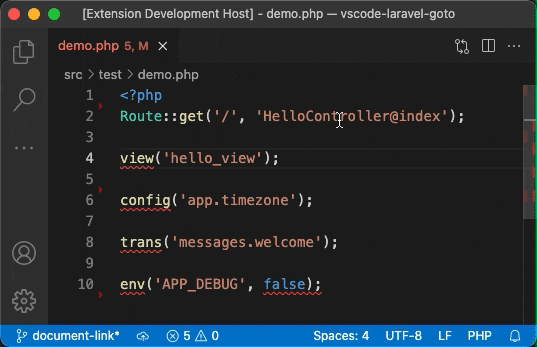
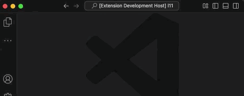
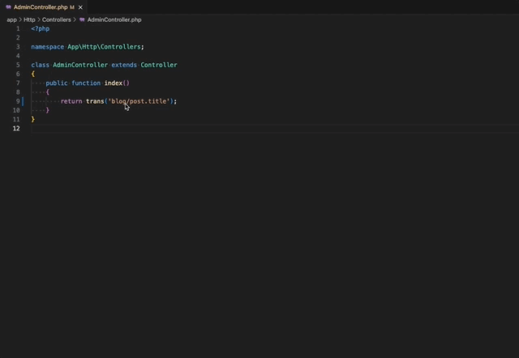
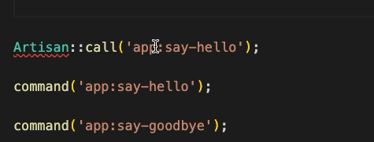

# Laravel Goto

[](https://marketplace.visualstudio.com/items?itemName=absszero.vscode-laravel-goto)
[](https://marketplace.visualstudio.com/items?itemName=absszero.vscode-laravel-goto)


Go to various Laravel files.




## Features

### Go to Blade

Go to blade template files.

```php
view('hello_view', ['name' => 'James']);

Route::view('/', 'pages.public.index');

@includeIf('view.name', ['status' => 'complete'])

@each('view.name', $jobs, 'job', 'view.empty')

@extends('layouts.app')
```

Go to blade Component files.

```php
<x-alert:hello />
```

### Go to Controller

Go to controllers and highlight method.

```php
Route::get('/', 'HelloController@index');

Route::resource('photo', 'HelloController', ['only' => [
  'index', 'show'
]]);
```

### Go to Controller via Uris

Go to the controller via the "Laravel Goto: Go to Controller via Uris" command.



### Go to Controller from route helper


### Go to Middleware


### Go to Config

Go to config files and highlight option.

```php
Config::get('app.timezone');
Config::set('app.timezone', 'UTC');
```

### Go to Filesystem config

Go to filesystem config file and highlight option.

```php
Storage::disk('local')->put('example.txt', 'Contents');
```


### Go to Language

Go to single language file.
```php
__('messages.welcome');

@lang('messages.welcome');

trans('messages.welcome');

trans_choice('messages.apples', 10);
```

Open all and highlight option.



### Go to .env

```
env('APP_DEBUG', false);
```

### Go to Command




### Go to Inertia.js

```php
Route::inertia('/about', 'About/AboutComponent');

Inertia::render('MyComponent');

inertia('About/AboutComponent');
```

### Go to Livewire

```php
@livewire('nav.show-post')

<livewire:nav.show-post />
```

### Go to path helper

```php
app_path('User.php');

base_path('vendor');

config_path('app.php');

database_path('UserFactory.php');

public_path('css/app.css');

resource_path('sass/app.scss');

storage_path('logs/laravel.log');
```

### Go to Static files

```php
$file = 'js/hello.js';
```

Default supported static file extensions:

- js
- ts
- jsx
- vue
- css
- scss
- sass
- less
- styl
- htm
- html
- xhtml
- xml
- log


## Requirements

#### Enable `Go to Symbol in File` for PHP

To enable moving to Method directly after a Controller is opened. Make sure one of these extensions is installed.

- https://marketplace.visualstudio.com/items?itemName=linyang95.php-symbols

- https://marketplace.visualstudio.com/items?itemName=felixfbecker.php-intellisense

- https://marketplace.visualstudio.com/items?itemName=bmewburn.vscode-intelephense-client


## Usage

- Move cursor on a text, and click the hover content, or press <kbd>Alt</kbd> + <kbd>;</kbd> to run the command.
- Or Select a text, `Right-Click` to open content menu, Choose `Laravel Goto`.
